# Hi, I'm Karan Patel 👋

  <picture>
    <source media="(prefers-color-scheme: dark)" srcset="./dark.svg">
    <source media="(prefers-color-scheme: light)" srcset="./light.svg">
    
  </picture>

  <b>AI Engineer · Full-Stack Engineer · Backend Systems · AI & SaaS Builder</b>

  🤖 AI / LLMs &nbsp;·&nbsp;
  🐍 Python &nbsp;·&nbsp;
  ⚡ AWS &nbsp;·&nbsp;
  ⚛️ React.js
  &nbsp;·&nbsp;
  ⚙️ Node.js &nbsp;·&nbsp;
  🧠 System Design

I build **AI-powered products, scalable backend systems, SaaS platforms, automation workflows, and production web applications**.

My engineering interests sit at the intersection of **AI/LLMs, Python, serverless systems, full-stack development, backend architecture, API integrations, and developer automation**.

---

## 🤖 What I Build

- 🧠 **AI / LLM applications** — LLM integrations, AI workflows and intelligent product features
- 🐍 **Python systems** — APIs, automation, AI services and backend tooling
- 🚀 **SaaS products** — multi-user applications, dashboards, payments and product infrastructure
- ⚙️ **Backend systems** — APIs, async processing, caching, real-time systems and integrations
- ⚛️ **Full-stack applications** — React.js, Next.js, Node.js and TypeScript
- 📈 **Performance & scalability** — production optimization, high-volume processing and system design
- 🌐 **Third-party integrations** — external APIs, webhooks, GPS, ELD, telematics and business systems

---

## 💼 Experience

### Senior Software Engineer — Codeminks Pvt. Ltd.
**Feb 2024 – Present**

Working on scalable software systems with a strong focus on
AI-assisted development, backend engineering, APIs, integrations,
and cloud-based applications.

- 🤖 Using **Claude AI** as an AI pair programmer for feature planning,
  architecture discussions, backend development, debugging,
  refactoring, database migration planning, and production issue resolution
- ⚡ Adopting **AI-first development workflows / Vibe Coding** to
  accelerate feature delivery while maintaining code quality and
  engineering standards
- 🚚 Developing **TracxTMS**, a cloud-based Transportation Management
  System using **Node.js, React.js, and PostgreSQL**
- 🏗️ Architecting scalable backend modules for **dispatch management,
  geofencing, and load coordination**
- 📍 Integrating third-party GPS tracking platforms including
  **Samsara, Motive, and Geotab**
- 🔄 Working on database migration and system modernization initiatives
- 🚀 Designing and implementing **CI/CD pipelines** using GitHub Actions
  and Bitbucket
- 🤝 Collaborating with cross-functional Agile teams to deliver
  production-ready features within sprint timelines
- 🧠 Applying **AIDLC workflows** to improve development speed and
  code quality across modules

### Web Developer — SPEC-INDIA
**May 2022 – Feb 2024**

- 💪 Built full-stack fitness platforms including **INSHAPE** and
  **SIXPACK** using React.js and Laravel
- 🔐 Implemented secure authentication using **JWT** for web and
  mobile applications
- 📱 Developed dynamic and responsive interfaces with real-time
  workout tracking features
- 🌐 Enhanced and maintained the **Gujarat Gas** corporate website
  with backend optimizations
- ⚡ Optimized MySQL queries to improve application performance
  and reduce load times

### Web Developer — Creole Studios
**Mar 2020 – Apr 2022**

- 👕 Led development of **MODTOD**, a children's fashion
  e-commerce platform using Node.js and React.js
- 🌐 Designed scalable RESTful APIs for product, cart,
  and order management
- 💳 Integrated **Stripe** payment gateway with secure
  OAuth 2.0 and JWT authentication
- 🎓 Developed **Sixclouds**, an educational content delivery
  platform using Laravel
- 🔐 Implemented role-based access control (RBAC)
- 🔍 Conducted code reviews to maintain application quality

### Web Developer — Samcom Technobrains
**Sep 2019 – Apr 2020**

- 🛍️ Developed **CADABRA**, an e-commerce platform using
  Laravel and MySQL
- 🌐 Built RESTful APIs for product catalog, cart,
  and order workflows
- 🔐 Implemented secure authentication using Laravel Auth and JWT
- 💳 Integrated Stripe payment processing with encryption
  and token validation
- 🤝 Collaborated with QA teams to ensure smooth releases

---

## 🛠️ Engineering Stack

### 🤖 AI / Machine Learning

  

  
  
  
  
  
  

### ⚛️ Frontend

  

  
  
  
  
  
  

### ⚙️ Backend & APIs

  

  
  
  
  
  

### 🗄️ Databases

  

### ☁️ Cloud / DevOps

  

  
  
  
  
  
  

### 🧠 Architecture & Engineering

  
  
  
  
  
  
  

---

## 📊 GitHub Activity

  

  

  

---

## 📫 Connect With Me

  <a href="https://github.com/karankantesariya120198">💻 GitHub</a>
  &nbsp;·&nbsp;
  <a href="https://linkedin.com/in/karankantesariya">💼 LinkedIn</a>
  &nbsp;·&nbsp;
  <a href="https://instagram.com/karankantesariya">📸 Instagram</a>
  &nbsp;·&nbsp;
  <a href="mailto:karankantesariya123@gmail.com">📧 Email</a>

  

---

  <b>Build clean. Solve hard problems. Ship reliable software. 🚀</b>

